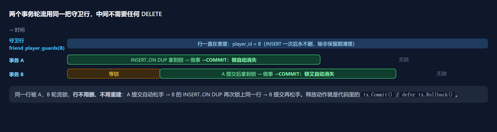
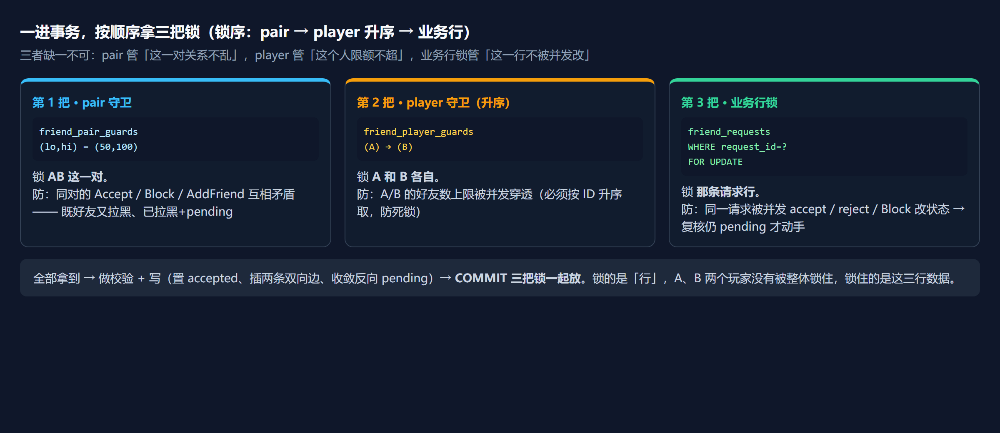
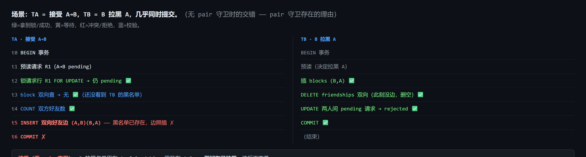
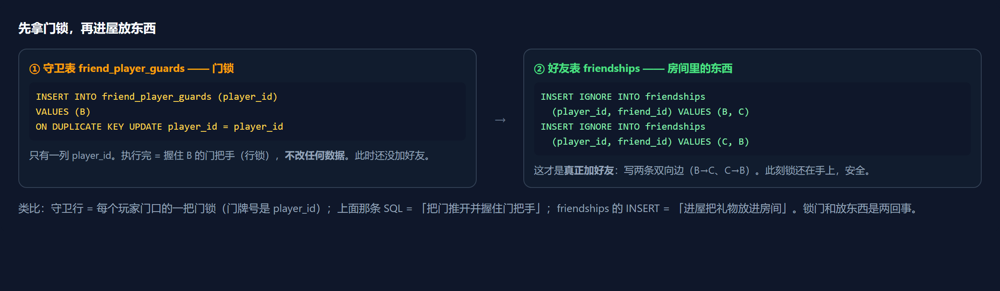
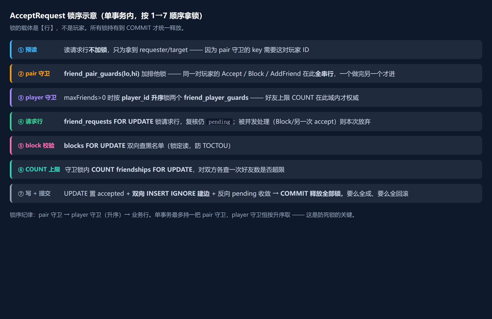
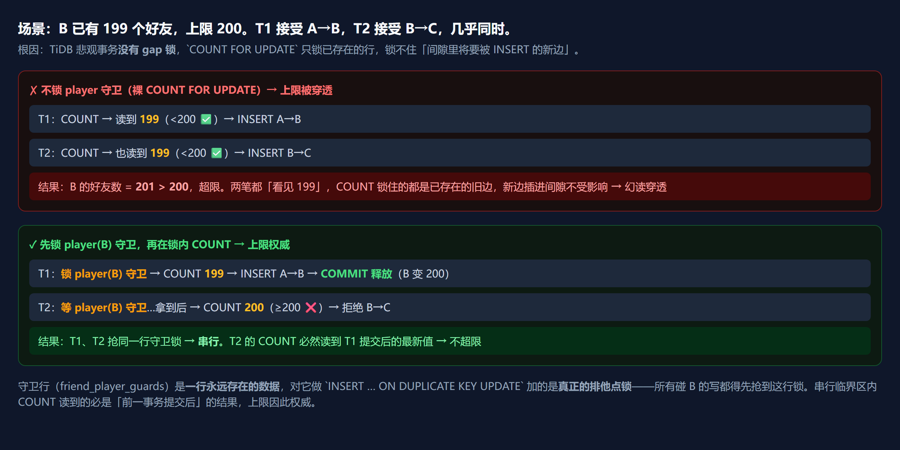
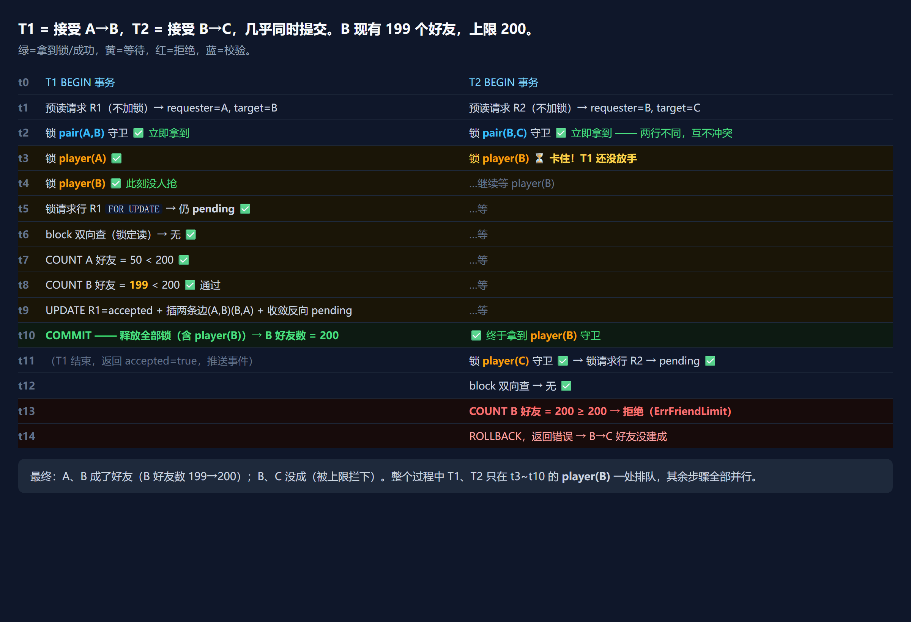
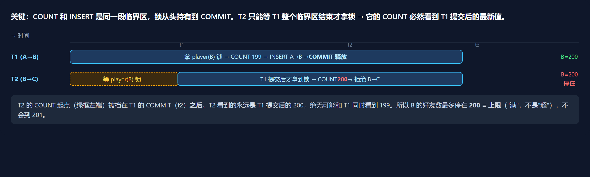
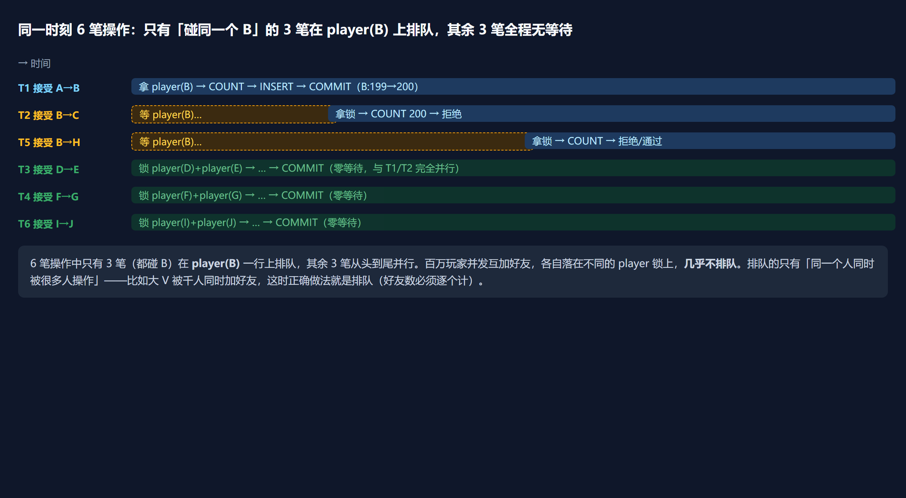

# 好友系统锁机制解读:AcceptRequest 到底怎么"锁住两个玩家"

> 状态:**解读笔记**(2026-09-24,由"锁是怎么工作的"问答整理)。
> 关联代码:[services/social/friend/internal/data/friend_repo.go](../../services/social/friend/internal/data/friend_repo.go)
> 关联设计:[friend-distributed-scaling.md](./friend-distributed-scaling.md)、DDL:[deploy/tidb-init/01-social-tidb.sql](../../deploy/tidb-init/01-social-tidb.sql)
>
> 本文不新增设计、不改代码,只把现有 `AcceptRequest` 的锁模型讲透,
> 回答四个高频疑问:锁的是谁?怎么锁?锁什么时候放?并发 AB/BC 怎么互不干扰。
>
> **图解**:每张图以 PNG 形式内嵌在对应小节(2400px 高清),图下方附「原图(HTML)」链接,
> 浏览器打开为矢量原图,可无限放大不失真。

---

## 1. 一句话结论(先回答最核心的误解)

**锁的不是"两个玩家",锁的是几行"数据"。** 而且这不是 Redis 那种分布式锁,
是**数据库的悲观行锁**——靠 `BEGIN…COMMIT` 事务 + 守卫行 + `FOR UPDATE` 把"同一对玩家 / 同一玩家的写"串行化。
当前代码连的是单 MySQL / TiDB(一个 `:4000`),**并不是多实例分布式**;
[friend-distributed-scaling.md](./friend-distributed-scaling.md) 讨论的是将来千万级拆多分片后的设计。

| 问题 | 快速回答 |
|---|---|
| 锁住 AB 了吗? | 锁了——pair 守卫,事务第一把锁,AB 共用一行 |
| 那 BC 呢? | B-C 是另一行 pair 守卫,和 AB **并行**;只有都碰 B 限额时才在 player(B) 排队 |
| 好友上限怎么防超? | player 守卫锁内做 COUNT,串行后 COUNT 必然读到最新已提交 |
| 那不还是串行? | 只有抢同一把锁的才串行,串行面 = **单个玩家宽度**,不同玩家全程并行 |
| 锁什么时候释放? | **COMMIT/ROLLBACK 自动释放**,不需要 DELETE |

---

## 2. 核心概念:行是行,锁是锁

这是整套机制最容易卡住的一层,先立住:

| | 是什么 | 生命周期 |
|---|---|---|
| **守卫行**(表里那行,如 `player_id=B`) | 一把"门",锁的载体,无业务数据 | 除非保留期清理 DELETE,否则永远存在 |
| **锁**(X 锁 / 排他锁) | 事务"握着门把手的手" | **事务 COMMIT/ROLLBACK 那一刻自动松手** |

数据库行锁的基本语义:**锁的持有者是"事务",不是"语句"也不是"表行"。**
事务一结束,它持有的**所有**行锁由 InnoDB/TiDB 自动释放——没有、也不需要应用手动 DELETE 来解锁。
MySQL/TiDB 里根本没有"手动释放行锁"的命令,唯一释放途径就是结束事务。

代码里的"释放"就是每个事务结尾的:

```go
if cerr := tx.Commit(); cerr != nil { ... }   // 提交 = 释放全部行锁
```

以及开头的兜底:

```go
defer func() { _ = tx.Rollback() }()          // 任何路径没走到 Commit,回滚 = 锁也释放
```

`COMMIT` 或 `ROLLBACK` 都会让该事务持有的所有行锁(pair 守卫、player 守卫、业务行 `FOR UPDATE` 锁)
**一次性全部自动释放**。



> 原图(HTML):[fig10-row-vs-lock.html](./figures/fig10-row-vs-lock.html)

---

## 3. 三把锁模型:AcceptRequest 一进事务,按序拿三把锁

锁序纪律:**pair 守卫 → player 守卫(升序)→ 业务行**。三者缺一不可:



> 原图(HTML):[fig5-three-locks.html](./figures/fig5-three-locks.html)

| 锁 | 载体表 | 锁什么 | 防的问题 | 拿锁语句 |
|---|---|---|---|---|
| **pair 守卫**(第 1 把) | `friend_pair_guards(lo_id, hi_id)` | **一对玩家**共用一行 | 同对的 Accept/Block/AddFriend 互相矛盾(既好友又拉黑、已拉黑+pending、已好友+pending) | `INSERT..ON DUPLICATE KEY UPDATE` |
| **player 守卫**(第 2 把,升序) | `friend_player_guards(player_id)` | **单个玩家**各自一行 | A/B 的好友数、黑名单数上限被并发穿透 | `INSERT..ON DUPLICATE KEY UPDATE` |
| **业务行锁**(第 3 把) | `friend_requests` / `blocks` / `friendships`(真数据) | 具体那条数据行 | 同一请求被并发 accept/reject/Block 改状态;读陈旧快照 | `SELECT ... FOR UPDATE`(锁定读) |

### 3.1 守卫表长什么样(DDL 摘录)

```sql
-- 每玩家一把"门锁",一行 = 一个玩家
CREATE TABLE `friend_player_guards` (
    `player_id` BIGINT UNSIGNED NOT NULL COMMENT '守卫行归属玩家(锁粒度=单玩家限额域)',
    PRIMARY KEY (`player_id`)
);

-- 每对玩家一把"门锁",lo/hi 排序后当主键 → A→B 与 B→A 共用同一行
CREATE TABLE `friend_pair_guards` (
    `lo_id` BIGINT UNSIGNED NOT NULL COMMENT '关系对较小 player_id',
    `hi_id` BIGINT UNSIGNED NOT NULL COMMENT '关系对较大 player_id',
    `created_at` TIMESTAMP NOT NULL DEFAULT CURRENT_TIMESTAMP COMMENT '首次取守卫时间(保留期 sweep 依据)',
    PRIMARY KEY (`lo_id`, `hi_id`),
    KEY `idx_created` (`created_at`)
);
```

**两张守卫表不存任何业务数据**,专门当"锁的载体"。真存好友关系的是 `friendships`(player_id, friend_id)。



> 原图(HTML):[fig7-block-accept.html](./figures/fig7-block-accept.html)

### 3.2 拿锁 SQL 逐字拆解

```sql
INSERT INTO friend_player_guards (player_id) VALUES (?)
ON DUPLICATE KEY UPDATE player_id = player_id
```

它只做一件事:**让当前事务拿到 `player_id = ?` 这一行的排他锁**。分两种情况:

| 情况 | 发生什么 | 锁 |
|---|---|---|
| 行**不存在**(第一次有人碰这个玩家) | 走 `INSERT`,插入一行 | 对**新插入的这一行**加排他锁(事务提交前别人碰它会被阻塞) |
| 行**已存在** | 主键冲突,走 `ON DUPLICATE KEY UPDATE` | 执行 `player_id = player_id`(**自己赋给自己,值不变**),对命中的行加排他锁 |

两条路殊途同归:**语句一结束,事务就握着这一行的排他锁,直到 COMMIT/ROLLBACK 才放手。**

为什么用 `player_id = player_id` 这个"废话"?因为我们要的是**锁,不是改数据**——
`UPDATE` 一行会拿行锁,把值设成自己,锁拿到了,数据一个字节都没变。这是数据库里经典的
"空更新拿锁"惯用法(`INSERT ... ON DUPLICATE KEY UPDATE` = "没有就建、有就锁"的一步原子写法,
正好适合守卫行:第一次来的事务顺便把门建好,之后来的事务直接锁门)。

pair 守卫同款,只是主键变成一对:

```sql
INSERT INTO friend_pair_guards (lo_id, hi_id) VALUES (?, ?)
ON DUPLICATE KEY UPDATE lo_id = lo_id
```

**关键点:两个 ID 先排大小序(lo 小 hi 大)再当主键**,所以 A(50)、B(100) 这对,
无论从 A 还是 B 发起,落到的都是 `(50,100)` 这一行——**A→B 和 B→A 共用一把锁**。



> 原图(HTML):[fig9-lock-room.html](./figures/fig9-lock-room.html)

### 3.3 业务行锁:三处 `FOR UPDATE`

业务行锁不是守卫表,是**直接对真数据行**加锁:

```sql
-- ① 锁请求行:复核这条请求仍是 pending(防被并发 accept/reject/Block 改掉;预读与取锁之间行可能已被并发处理)
SELECT requester_id, target_id, status FROM friend_requests
WHERE request_id = ? FOR UPDATE

-- ② 锁黑名单行:双向查,拿"当前已提交"的拉黑状态(防 TOCTOU)
SELECT 1 FROM blocks
WHERE (player_id = ? AND blocked_id = ?) OR (player_id = ? AND blocked_id = ?) LIMIT 1 FOR UPDATE

-- ③ 锁好友边行:守卫锁内 COUNT,拿最新已提交的好友数(防漏计)
SELECT COUNT(*) FROM friendships WHERE player_id = ? FOR UPDATE
```

为什么守卫锁拿完还要锁业务行?因为守卫锁管"**串行化写者**",业务行锁管"**这一行数据的即时状态**":

- **请求行**:守卫锁只保证"同一对的写者排队",但排到你的那一刻,请求可能已被前面的人改成
  `accepted`/`rejected` 了——必须 `FOR UPDATE` 锁住请求行**重读一次**,确认还是 `pending` 才动手;
- **block / COUNT**:事务第一条普通 SELECT 会把读快照固定住(RR),普通读会看到**陈旧状态**
  (看不到守卫等待期间别人提交的 Block/建边)。`FOR UPDATE` 是**当前读**,强制读最新已提交 → 校验才权威。



> 原图(HTML):[fig1-lock-order.html](./figures/fig1-lock-order.html)

---

## 4. 为什么需要守卫行:TiDB 没有 gap 锁

**核心疑问**:好友上限为什么不能直接 `SELECT COUNT(*) ... FOR UPDATE` 解决?

因为 COUNT 的锁定读只锁**命中且已存在**的行。B 现在那 199 条边会被锁住,但并发要 INSERT 的
**第 200/201 条新边在索引的"间隙"里**——TiDB 悲观事务没有 MySQL 的 next-key/gap 锁,
**间隙没锁**,两个新 INSERT 互相不阻塞,全插进去了 → 上限被穿透。

守卫行就是为补这个洞:它是一行**本来就存在的、物理上确定的行**,
`INSERT ... ON DUPLICATE KEY UPDATE` 对它的效果 = "不存在就建行、存在就锁这一行",
这把**点锁是真实的排他锁**,所有碰 B 的写都要抢它 → 在守卫行上**串行**。
串行临界区内 COUNT 读到的必是"前一事务提交后"的结果,上限因此权威。

> 对比 MySQL InnoDB:它自带 next-key 锁,`COUNT FOR UPDATE` 天然锁住间隙挡住并发 INSERT,
> 所以**单 MySQL 时其实可以不靠守卫行**——守卫行是切到 TiDB 后才加的补丁
> (代码注释与 DDL 注释都点明了这点:TiDB 无 gap 锁,守卫行替代 COUNT..FOR UPDATE)。



> 原图(HTML):[fig3-limit-guard.html](./figures/fig3-limit-guard.html)

---

## 5. 完整走查:AB 与 BC 并发接受

**场景**:T1 = 接受 A→B,T2 = 接受 B→C,几乎同时提交;B 已有 199 个好友,上限 200。


> 原图(HTML):[fig2-ab-bc-converge.html](./figures/fig2-ab-bc-converge.html)

| 时刻 | T1(接受 A→B) | T2(接受 B→C) |
|---|---|---|
| t0 | BEGIN | BEGIN |
| t1 | 预读请求 R1(不加锁)→ requester=A, target=B | 预读请求 R2(不加锁)→ requester=B, target=C |
| t2 | 锁 **pair(A,B)** 守卫 ✅ 立即拿到 | 锁 **pair(B,C)** 守卫 ✅ 立即拿到 —— **两行不同,互不冲突** |
| t3 | 锁 player(A) ✅ | 锁 player(B) ⏳ **卡住!T1 还没放手** |
| t4 | 锁 player(B) ✅ 此刻没人抢 | …继续等 player(B) |
| t5 | 锁请求行 R1 FOR UPDATE → 仍 pending ✅ | …等 |
| t6 | block 双向查(锁定读)→ 无 ✅ | …等 |
| t7 | COUNT A 好友 = 50 < 200 ✅ | …等 |
| t8 | COUNT B 好友 = **199** < 200 ✅ 通过 | …等 |
| t9 | UPDATE R1=accepted + 插两条边(A,B)(B,A) + 收敛反向 pending | …等 |
| t10 | **COMMIT —— 释放全部锁(含 player(B))→ B 好友数 = 200** | ✅ 终于拿到 player(B) 守卫 |
| t11 | (结束,accepted=true,推送事件) | 锁 player(C) ✅ → 锁请求行 R2 → pending ✅ |
| t12 | | block 双向查 → 无 ✅ |
| t13 | | COUNT B 好友 = **200** ≥ 200 → **拒绝(ErrFriendLimit)** |
| t14 | | ROLLBACK,返回错误 → B→C 好友没建成 |



> 原图(HTML):[fig6-walkthrough.html](./figures/fig6-walkthrough.html)

**最终**:A、B 成了好友(B 好友数 199→200);B、C 没成(被上限拦下)。
整个过程中 T1、T2 只在 t3~t10 的 **player(B)** 一处排队,其余步骤全部并行。

**走查里 4 个值得记住的点**:

1. **t2:两把 pair 锁是不同行**——`pair(A,B)` 和 `pair(B,C)` 互不相关,各自立刻拿到,没有等待。
   这就是"锁住 AB 不会挡住 BC"的现场。
2. **t3~t10:唯一排队点 = player(B)**。T2 等锁时手里已握着 `pair(B,C)`,但 T1 永远不碰
   `pair(B,C)`,**不存在循环等待 → 不会死锁**。
3. **t8 vs t13:上限为什么准**——T1 在守卫锁内 COUNT 到 199 通过;T2 等 T1 提交后 COUNT 到 200 拒绝。
   **同一个 COUNT,只因串行先后不同,结果就不同**——这正是守卫锁的价值:让 COUNT 永远看到"最新已提交"。
4. **结果状态干净**:T1 成功建边并提交;T2 失败回滚,B-C 没建边、R2 仍是 pending(还能下次再试)。
   不存在"半条边""既好友又拉黑"这类脏状态。



> 原图(HTML):[fig8-holder-interval.html](./figures/fig8-holder-interval.html)

---

## 6. 串行面有多窄:只有抢同一把锁的人才排队

串行不是缺陷,是"硬上限"必须付的代价(好友数是计数器,计数必须线性化——两个并发 +1 不串行就变 201;
这在**单机 MySQL 也一样**,不是分布式引入的问题)。

**锁从来不是"A、B 两个人一把锁"。** 每把锁只是一行:player(B) 一行、pair(A,B) 一行。
A-B 事务拿的是 3 行锁,B-C 事务拿的是另外 3 行,两者只碰撞 player(B) 这一行。
**串行粒度 = 单个玩家**,不是一对、不是全局。

6 笔操作并发时,只有"碰同一个 B"的 3 笔在 player(B) 上排队,其余 3 笔从头到尾并行。
百万玩家并发互加好友,各自落在不同的 player 锁上,几乎不排队。排队的只有
"同一个人同时被很多人操作"——比如大 V 被千人同时加好友,这时正确做法就是排队
(好友数必须逐个计)。[friend-distributed-scaling.md](./friend-distributed-scaling.md) §5.3/§10 也承认:
不想排就放弃硬上限改软上限(允许极端情况超几个,后台对账)。

**分布式的收益不在"消除单玩家串行",在"容量 + 跨玩家并行"**。单 MySQL 也能让不同玩家并行;
分片/TiDB 解决的是单库写不下、表太大、备份太慢,而不是"某个人被加好友要不要排队"。
大 V 的排队问题在单库和分布式下**一样存在**,这是业务语义(计数正确)决定的,不是架构决定的。



> 原图(HTML):[fig4-serial-width.html](./figures/fig4-serial-width.html)

---

## 7. 锁序纪律:为什么必须是 pair → player(升序)→ 业务行

- 单事务至多持有一个 pair 守卫;
- player 守卫恒按 player_id **升序**获取(两个事务各自锁 A、B 时都先锁小 ID 再锁大 ID);
- 业务行锁(请求行等)在守卫锁之后取。

这是防死锁的关键(2026-08-11 真踩过 1213 死锁,详见 `friend_repo.go` 文件头注释):
所有路径统一锁序,就不会出现"事务 X 持 A 等 B、事务 Y 持 B 等 A"的环。
间隙锁相关的死锁形态(InnoDB RR 下未命中的 FOR UPDATE 锁的是间隙、间隙锁彼此相容、
插入意向锁等)在 `friend_repo.go` 的 `friendWriteTxIsolation` 注释里有完整记录——写事务显式用
**READ COMMITTED** 就是为了不依赖 gap 锁语义。

---

## 8. 与扩容设计的关系:现在锁,将来怎么锁

| | 当前(阶段 2 = TiDB) | 未来(阶段 3 = 分片 + 异步,§5) |
|---|---|---|
| 锁模型 | 三把悲观锁:pair 守卫 + player 守卫 + 业务行 FOR UPDATE | **锁 request 单行做 CAS**(`UPDATE friend_requests SET status=accepted WHERE request_id=? AND status=pending`,影响行数=1 才算赢) |
| 双向建边 | 同事务两条 INSERT IGNORE,原子 | 发 Kafka 事件,两个分片各自幂等落一条边,最终一致 |
| 上限 | 硬上限(守卫内 COUNT) | 软上限(§5.3;走 TiDB 阶段 2 仍保硬约束,§10) |
| 一致性 | 强一致(事务 + 悲观锁) | request 强一致 + 边最终一致(秒级收敛) |

选 TiDB 的全部理由:friend 服务只连一个 SQL 入口 `:4000`,`BEGIN / FOR UPDATE / 多表写 / COMMIT`
TiDB 都能跨节点跑(COMMIT 自动走 Percolator 2PC),**强一致与硬上限语义都保留,业务代码一行不改**。
真到阶段 3 极限体量再拆成 CAS + Kafka 异步建边,卸掉 2PC 压力。

---

## 9. 附录:代码 / 文档锚点

- 事务实现:`services/social/friend/internal/data/friend_repo.go`
  - `AcceptRequest`(三把锁完整流程)、`CreateRequest` / `Block`(同款守卫,Block 写黑名单 + 删双边 + 取消 pending)
  - `acquirePairGuard` / `acquirePlayerGuard`(守卫行拿锁 SQL)
  - `checkIncomingLimit`(收件箱上限,守卫锁内 COUNT)
- DDL:`deploy/tidb-init/01-social-tidb.sql` §(friend_player_guards / friend_pair_guards 表结构)
- 扩容设计:`docs/design/friend-distributed-scaling.md`(§5 分片形态、§8 TiDB、§10 软上限取舍)
- 不变量:CLAUDE.md §9(TiDB 无 gap 锁、守卫行机制、保留期清理 §9.24)
